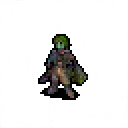
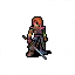
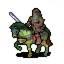
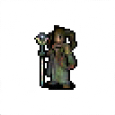
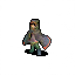
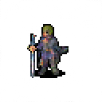

# SpriteFlow: Flow-based Pixel Art Character Generation

<p float="left">






</p>

A PyTorch implementation of a flow-based generative model for creating 128x128 RGBA pixel 
art characters. This project uses continuous normalizing flows with a U-Net 
architecture to learn the data distribution and generate quality pixel art sprites.

## 🎨 Overview
This project implements a flow-based generative model that learns to transform simple 
noise distributions (Isotropic Gaussian) into complex pixel art characters. The model uses:

- **Flow-based architecture**: Continuous normalizing flows for high-quality generation
- **U-Net backbone**: Time-conditioned U-Net for learning the vector field
- **RGBA support**: Full transparency support for pixel art sprites
- **Flexible training**: Configurable noise schedules and training parameters

## 🤖 Model architecture
*TODO: Soon - Final model architecture image*

## 🚀 Features
- **Multiple noise schedules**: Linear and cosine scheduling options
- **Evaluation metrics**: FID (Fréchet Inception Distance) for quality assessment
- **Training utilities**: Learning rate scheduling, checkpointing, and visualization
- **Flexible sampling**: Support for different generation modes and timesteps
- **Experiment tracking**: CSV logging and training visualization tools
- **Exponential Moving Average (EMA)**: Stabilizes training and improves sample quality

## 📋 Requirements
Install the required dependencies:

```bash
pip install -r requirements.txt
```

## 🗂️ Project Structure

```
├── dataset/
│   ├── images/                          # Your pixel art dataset (RGBA images)
│   └── image_only_dataset.py            # Dataset loading utilities
├── diff_eq/
│   ├── ode_sde.py                       # ODE/SDE implementations
│   └── simulator.py                     # Numerical integration methods
├── models/
│   ├── conditional_vector_field.py      # Conditional vector field
│   └── unet.py                          # U-Net architecture with time conditioning
├── sampling/
│   ├── conditional_probability_path.py  # Flow probability paths
│   ├── noise_scheduling.py              # Alpha/beta scheduling functions
│   └── sampleable.py                    # Dataset samplers and distributions
├── training/
│   ├── ema.py                           # Exponential Moving Averag
│   ├── evaluation.py                    # Evaluation metrics (FID)
│   ├── lr_scheduling.py                 # Learning rate schedulers
│   ├── trainer.py                       # Main training loop
│   └── experiments/                     # Training notebooks, outputs and checkpoints
└── utils/
    ├── helpers.py                       # Utility functions
    └── visualization.py                 # Training visualization tools
```


## 📊 Monitoring Training

The training process automatically logs:

- **Training loss**: Flow matching objective loss
- **Validation FID**: Fréchet Inception Distance on validation set
- **Generated samples**: Saved periodically for visual inspection
- **Model checkpoints**: Best model based on validation FID

Logs are saved to `training/experiments/model_name/training_log.csv` and can be visualized using the built-in visualization tools.

## 📄 License

This project is licensed under the MIT License - see the [LICENSE](LICENSE) file for details.

## 🤝 Contributing

Contributions are welcome! Please feel free to submit a Pull Request.
